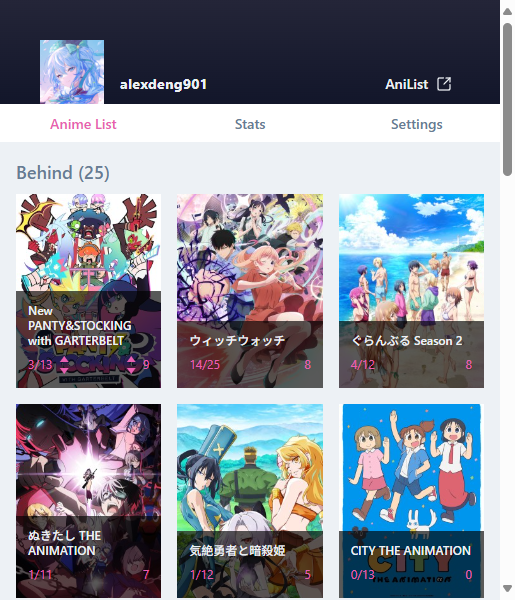
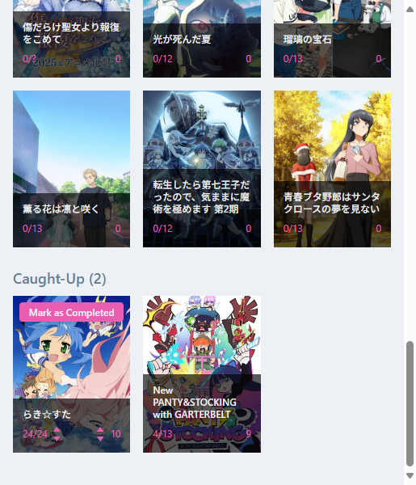

# AniPortable

_A lightweight browser extension to track and manage your AniList anime directly from your current tab._

---

## Overview

**AniPortable** brings core AniList features directly into your browser, allowing seamless interaction with your anime list. Instantly update episode progress, view statistics, and manage your lists without navigating away from your current tab.

---

## Features

- Quickly update your progress or score using arrow buttons, or type in an exact number by clicking it directly.
- View your completed anime stats in a bar chart, with filters for year and season.
- Split your Watching list into **Behind** and **Caught up** — making it easy to see what needs watching.
- Keep anime in your Watching section even after reaching the final episode — ideal for screenshots or reviews — and move them to Completed with one click.

---

## Screenshots

| List View | Stats View | Settings View |
|-----------|------------|----------------|
|  |  |  |
|  |  | |

---

## Getting Started

To run AniPortable locally:

1. Clone the repository.
2. Register your app with [AniList API](https://anilist.co/settings/developer) and obtain a `client_id`.
3. Create a local config file to store your credentials. This file is `.gitignore` for security.
4. Run `npm install` to install dependencies.
5. Use `npx plasmo build` to build a local development with Plasmo.

---

## Permissions

AniPortable requests the following Chrome Extension permissions:

- **storage** – Used to persist user settings locally within the extension.
- **identity** – Required to initiate the AniList OAuth login flow using `chrome.identity.launchWebAuthFlow`.

These are minimal and used solely to deliver core functionality securely and privately.

---

## Acknowledgements

- **[AniList](https://anilist.co)** – For providing a powerful and flexible GraphQL API.
- **[Plasmo](https://www.plasmo.com/)** – Extension framework used for fast development and MV3 support.
- **React** – UI components and hooks.
- **Apollo Client** – Simplifies interaction with AniList's GraphQL API.
- **Recharts** – Used for data visualization in the Stats view.

