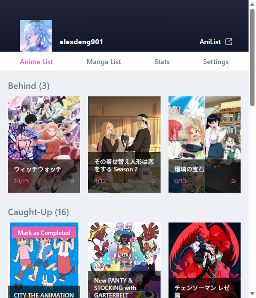
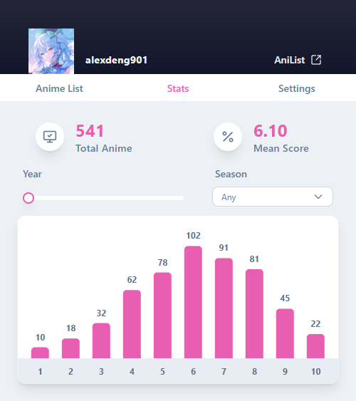
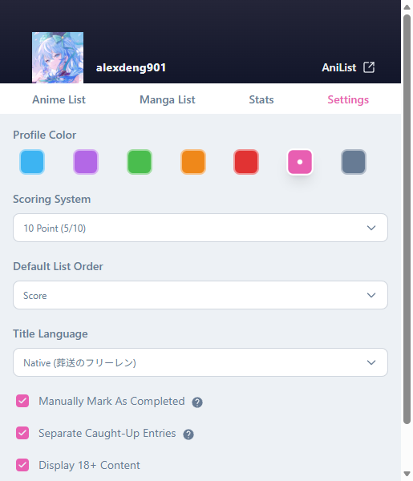
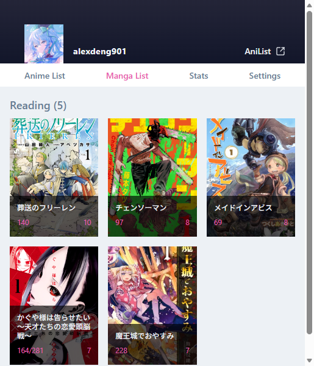
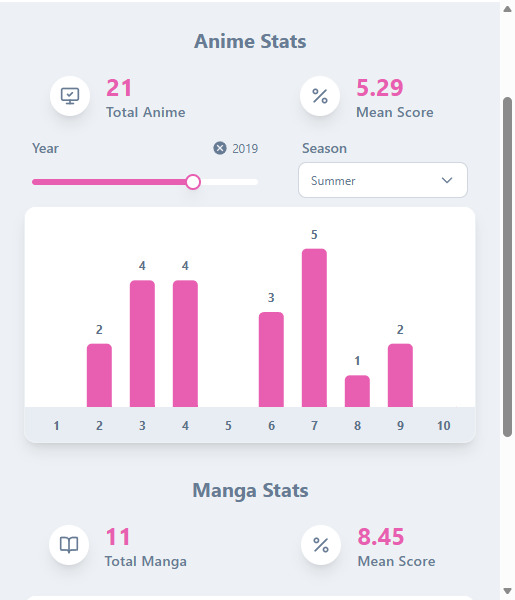
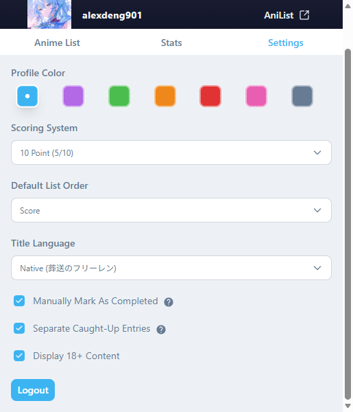

# AniPortable

_A lightweight browser extension to manage your AniList anime and manga — without leaving your current tab._

## Overview

**AniPortable** brings core AniList features directly into your browser for seamless tracking. Update your anime and manga progress, check your stats, and manage your lists — all without navigating away from what you're doing.

## Features

- **Quick updates** — Bump episode/chapter progress or scores with arrow buttons, or click to type an exact number
- **Visual stats** — View your anime and manga stats in bar charts, with year and season filters for anime
- **Dynamic lists** — Split your Watching lists into **Behind** and **Caught Up** so you always know what needs attention
- **Flexible completion** — Enable manual completion to keep anime/manga in your current list after finishing — great for screenshots or reviews. Then mark complete with one click when you're ready

## Screenshots

<table>
  <tr>
    <th>Anime & Manga List</th>
    <th>Stats</th>
    <th>Settings</th>
  </tr>
  <tr>
    <td width="33%"></td>
    <td width="33%"></td>
    <td width="33%"></td>
  </tr>
  <tr>
    <td width="33%"></td>
    <td width="33%"></td>
    <td width="33%"></td>
  </tr>
</table>

## Getting Started

To run AniPortable locally:

1. Clone the repository and run `npm install`.
2. Register an app with the [AniList API](https://anilist.co/settings/developer), setting its **Redirect URL** to the one for your build (see below), and copy the `client_id`.
3. Copy `.env.example` to the matching env file and set `PLASMO_PUBLIC_ANILIST_CLIENT_ID` to that `client_id`. Every `.env*` file except the example is `.gitignore`d.
4. Build and load the extension (see [Builds](#builds)).

AniList allows one Redirect URL per app, so each build needs its own app and `client_id`:

| Build | Env file | Redirect URL |
| --- | --- | --- |
| Chrome, unpacked | `.env.development` | `https://<extension-id>.chromiumapp.org/` — ID is on `chrome://extensions` |
| Chrome, Web Store | `.env.production` | Same, with the Web Store's (different) `<extension-id>` |
| Firefox | `.env.firefox` | `https://2aa74d67c20b2df7e53c4ece72190bec8c657d82.extensions.allizom.org/` |

Chrome assigns the extension ID, and gives the unpacked and Web Store builds different ones — hence two Chrome apps. Firefox instead uses the ID declared in `browser_specific_settings.gecko.id` and derives the Redirect URL as `https://<sha1(id)>.extensions.allizom.org/`, which is identical for a temporary install and the signed AMO build — so one Firefox app covers both.

### Builds

| Command | Output |
| --- | --- |
| `npx plasmo dev` | `build/chrome-mv3-dev` (watch/HMR) |
| `npx plasmo build` | `build/chrome-mv3-prod` |
| `npx plasmo build --target=firefox-mv3` | `build/firefox-mv3-prod` |
| `npx plasmo package` | Zipped build, for store submission |
| `npx plasmo package --target=firefox-mv3` | Zipped build, for store submission |

Load the Chrome build with **Load unpacked** on `chrome://extensions`, or the Firefox build with **Load Temporary Add-on** on `about:debugging#/runtime/this-firefox`. On a `--target=firefox-*` build, `.env.firefox` outranks `.env.production`, so the Firefox `client_id` is picked up automatically.

## Permissions

AniPortable requests the following browser extension permissions:

- **storage** – Persists user settings and preferences locally.
- **identity** – Used to authenticate users through AniList via `identity.launchWebAuthFlow`.
- **host_permissions** (`https://graphql.anilist.co/`) – Allows the background script to call the AniList GraphQL API directly.

These are minimal and used solely to deliver core functionality securely and privately.

## Acknowledgements

- **[AniList](https://anilist.co)** – For providing a powerful and flexible GraphQL API.
- **[Plasmo](https://www.plasmo.com/)** – Extension framework used for fast development and MV3 support.
- **React** – UI components and hooks.
- **Apollo Client** – Simplifies interaction with AniList's GraphQL API.
- **Recharts** – Used for data visualization in the Stats view.

## License

This project is licensed under the [MIT License](./LICENSE).
