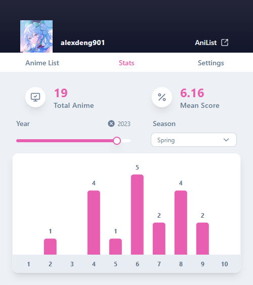

# AniPortable

_A lightweight browser extension to manage your AniList anime and manga — without leaving your current tab._

---

## Overview

**AniPortable** brings core AniList features directly into your browser for seamless tracking. Update your anime and manga progress, check your stats, and manage your lists — all without navigating away from what you're doing.

---

## Features

- **Quick updates** — Bump episode/chapter progress or scores with arrow buttons, or click to type an exact number
- **Visual stats** — View your anime and manga stats in bar charts, with year and season filters for anime
- **Smart organization** — Split your Watching/Reading lists into **Behind** and **Caught Up** so you always know what needs attention
- **Flexible completion** — Enable manual completion to keep anime/manga in your current list after finishing — great for screenshots or reviews. Then mark complete with one click when you're ready

---

## Screenshots

<table>
  <tr>
    <th>Anime & Manga List</th>
    <th>Stats</th>
    <th>Settings</th>
  </tr>
  <tr>
    <td width="33%"></td>
    <td width="33%"></td>
    <td width="33%"></td>
  </tr>
  <tr>
    <td width="33%"></td>
    <td width="33%"></td>
    <td width="33%"></td>
  </tr>
</table>

---

## Getting Started

To run AniPortable locally:

1. Clone the repository.
2. Register your app with [AniList API](https://anilist.co/settings/developer) and obtain a `client_id`.
3. Create the file `config/auth.config.ts` to store your credentials securely. This file is `.gitignore`d for security.
4. Run `npm install` to install dependencies.
5. Use `npx plasmo build` to build locally with Plasmo.

---

## Permissions

AniPortable requests the following Chrome Extension permissions:

- **storage** – Persists user settings and preferences locally.
- **identity** – Used to authenticate users through AniList via `chrome.identity.launchWebAuthFlow`.

These are minimal and used solely to deliver core functionality securely and privately.

---

## Acknowledgements

- **[AniList](https://anilist.co)** – For providing a powerful and flexible GraphQL API.
- **[Plasmo](https://www.plasmo.com/)** – Extension framework used for fast development and MV3 support.
- **React** – UI components and hooks.
- **Apollo Client** – Simplifies interaction with AniList's GraphQL API.
- **Recharts** – Used for data visualization in the Stats view.

---

## License

This project is licensed under the [MIT License](./LICENSE).