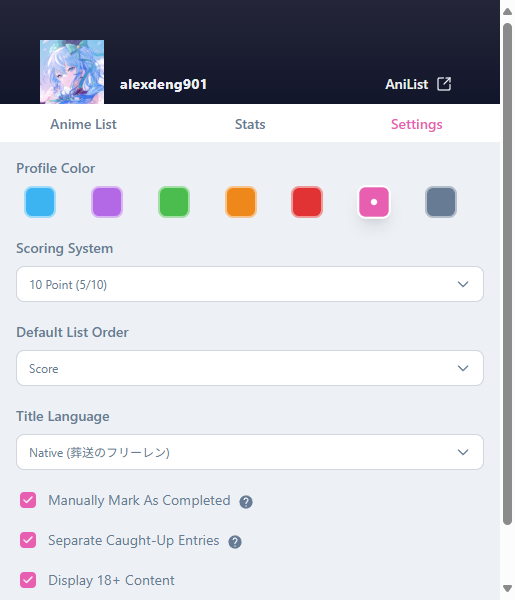

# AniPortable

_A lightweight browser extension to manage your AniList anime — without leaving your current tab._

---

## Overview

**AniPortable** brings core AniList features directly into your browser, allowing seamless interaction with your anime list. Instantly update episode progress, view statistics, and manage your lists without navigating away from your current tab.

---

## Features

- Instantly update episode progress or score using arrow buttons — or click to type an exact number.
- View your completed anime/manga stats in a bar chart, with filters for year and season.
- Separate your Watching list into **Behind** and **Caught Up**, so you know exactly what needs attention.
- Keep anime in Watching even after finishing the last episode — ideal for screenshots or reviews — then move it to Completed with one click.

---

## Screenshots

| Anime/Manga List | Stats | Settings |
|-----------|------------|----------------|
|  |  |  |
|  |  | |

---

## Getting Started

To run AniPortable locally:

1. Clone the repository.
2. Register your app with [AniList API](https://anilist.co/settings/developer) and obtain a `client_id`.
3. Create the file `config/auth.config.ts` to store your credentials securely. This file is `.gitignore`d for security.
4. Run `npm install` to install dependencies.
5. Use `npx plasmo build` to build locally with Plasmo.

---

## Permissions

AniPortable requests the following Chrome Extension permissions:

- **storage** – Persists user settings and preferences locally.
- **identity** – Used to authenticate users through AniList via `chrome.identity.launchWebAuthFlow`.

These are minimal and used solely to deliver core functionality securely and privately.

---

## Acknowledgements

- **[AniList](https://anilist.co)** – For providing a powerful and flexible GraphQL API.
- **[Plasmo](https://www.plasmo.com/)** – Extension framework used for fast development and MV3 support.
- **React** – UI components and hooks.
- **Apollo Client** – Simplifies interaction with AniList's GraphQL API.
- **Recharts** – Used for data visualization in the Stats view.

---

## License

This project is licensed under the [MIT License](./LICENSE).
